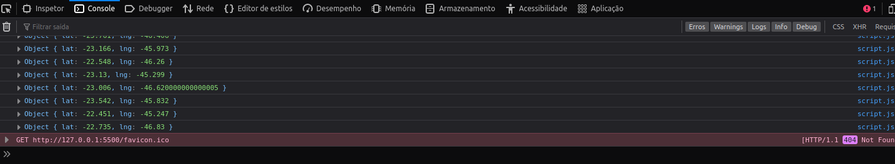
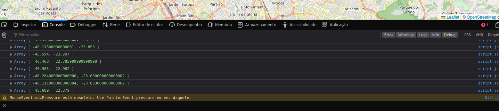
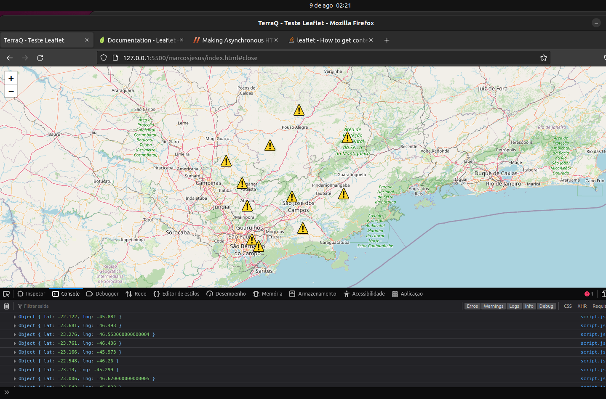
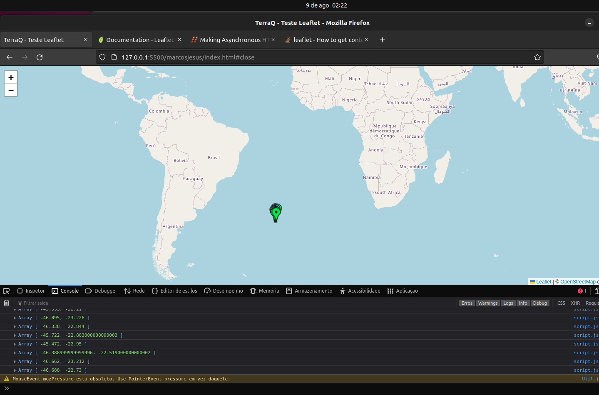

# Start

### A ideia principal aqui foi criar do zero pois não me senti confortável com Jquery, tenho algo parecido com React usando React-leaflet.

 

### Porém tive um problema que vocês não esperavam ( referente API ), no teste os points eles vem de outra api que não tenho acesso.

 

### Como você sabe ? o console me entregou rs, divergência de dados.

   

> Esses dados vem do boilerplate que vocês mandaram. (repare na sequencia de números da lat e lng começa tudo com 2.)
 
 

   

> Criando o meu ele me retornou dessa forma. (repare na sequencia de numeros da lat e lng começa tudo com 4.)
 
 

 

# Para um melhor entendimento do problema que me gerou.

 
 
 
 
 

# (imagem do meu boilerplate).

